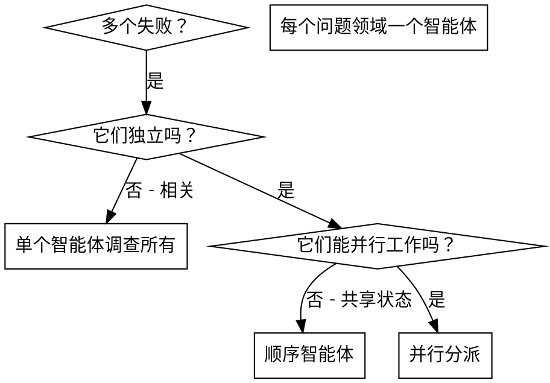

# 分派并行智能体 (Dispatching Parallel Agents)

## 概述

当你有多个不相关的失败（不同的测试文件，不同的子系统，不同的 Bug）时，按顺序调查浪费时间。每个调查都是独立的，可以并行发生。

**核心原则：** 为每个独立的问题领域分派一个智能体。让它们并发工作。

## 何时使用



**在以下情况使用：**
- 3+ 测试文件因不同的根本原因失败
- 多个子系统独立损坏
- 每个问题都可以在不需要其他上下文的情况下被理解
- 调查之间没有共享状态

**在以下情况不要使用：**
- 失败是相关的（修复一个可能修复其他）
- 需要了解整个系统状态
- 智能体可能会相互干扰

## 模式

### 1. 识别独立领域

按损坏内容对失败进行分组：
- 文件 A 测试：工具批准流程
- 文件 B 测试：批处理完成行为
- 文件 C 测试：中止功能

每个领域都是独立的 - 修复工具批准不会影响中止测试。

### 2. 创建聚焦的智能体任务

每个智能体获得：
- **特定范围：** 一个测试文件或子系统
- **明确目标：** 使这些测试通过
- **约束：** 不要更改其他代码
- **预期输出：** 你发现和修复内容的摘要

### 3. 并行分派

```typescript
// In Claude Code / AI environment
Task("Fix agent-tool-abort.test.ts failures")
Task("Fix batch-completion-behavior.test.ts failures")
Task("Fix tool-approval-race-conditions.test.ts failures")
// All three run concurrently
```

### 4. 审查和集成

当智能体返回时：
- 阅读每个摘要
- 验证修复不冲突
- 运行完整测试套件
- 集成所有更改

## 智能体提示词结构

好的智能体提示词是：
1. **聚焦** - 一个清晰的问题领域
2. **自包含** - 理解问题所需的所有上下文
3. **关于输出的具体说明** - 智能体应该返回什么？

```markdown
Fix the 3 failing tests in src/agents/agent-tool-abort.test.ts:

1. "should abort tool with partial output capture" - expects 'interrupted at' in message
2. "should handle mixed completed and aborted tools" - fast tool aborted instead of completed
3. "should properly track pendingToolCount" - expects 3 results but gets 0

These are timing/race condition issues. Your task:

1. Read the test file and understand what each test verifies
2. Identify root cause - timing issues or actual bugs?
3. Fix by:
   - Replacing arbitrary timeouts with event-based waiting
   - Fixing bugs in abort implementation if found
   - Adjusting test expectations if testing changed behavior

Do NOT just increase timeouts - find the real issue.

Return: Summary of what you found and what you fixed.
```

## 常见错误

**❌ 太宽泛：** "修复所有测试" - 智能体会迷失
**✅ 具体：** "修复 agent-tool-abort.test.ts" - 聚焦范围

**❌ 无上下文：** "修复竞争条件" - 智能体不知道在哪里
**✅ 上下文：** 粘贴错误消息和测试名称

**❌ 无约束：** 智能体可能会重构一切
**✅ 约束：** "不要更改生产代码" 或 "仅修复测试"

**❌ 模糊输出：** "修复它" - 你不知道什么改变了
**✅ 具体：** "返回根本原因和更改的摘要"

## 何时**不**使用

**相关失败：** 修复一个可能修复其他 - 先一起调查
**需要完整上下文：** 理解需要查看整个系统
**探索性调试：** 你还不知道哪里坏了
**共享状态：** 智能体会相互干扰（编辑相同文件，使用相同资源）

## 来自会话的真实示例

**场景：** 重大重构后 3 个文件的 6 个测试失败

**失败：**
- agent-tool-abort.test.ts: 3 failures (计时问题)
- batch-completion-behavior.test.ts: 2 failures (工具未执行)
- tool-approval-race-conditions.test.ts: 1 failure (执行计数 = 0)

**决定：** 独立领域 - 中止逻辑 与 批处理完成行为 与 竞争条件 分离

**分派：**
```
Agent 1 → Fix agent-tool-abort.test.ts
Agent 2 → Fix batch-completion-behavior.test.ts
Agent 3 → Fix tool-approval-race-conditions.test.ts
```

**结果：**
- Agent 1: 将超时替换为基于事件的等待
- Agent 2: 修复了事件结构 Bug (threadId 位置错误)
- Agent 3: 添加了对异步工具执行完成的等待

**集成：** 所有修复独立，无冲突，全套测试通过

**节省时间：** 并行解决 3 个问题 vs 顺序解决

## 主要好处

1. **并行化** - 多个调查同时发生
2. **聚焦** - 每个智能体范围狭窄，需要跟踪的上下文更少
3. **独立性** - 智能体不相互干扰
4. **速度** - 用解决 1 个问题的时间解决 3 个问题

## 验证

智能体返回后：
1. **审查每个摘要** - 了解更改了什么
2. **检查冲突** - 智能体是否编辑了相同代码？
3. **运行完整套件** - 验证所有修复一起工作
4. **抽查** - 智能体可能会犯系统性错误

**子智能体分派、任务描述及执行过程中的沟通讨论必须使用自然、专业的中文。**

## 现实世界影响

来自调试会话 (2025-10-03)：
- 3 个文件中的 6 个失败
- 并行分派 3 个智能体
- 所有调查并发完成
- 所有修复成功集成
- 智能体更改之间零冲突