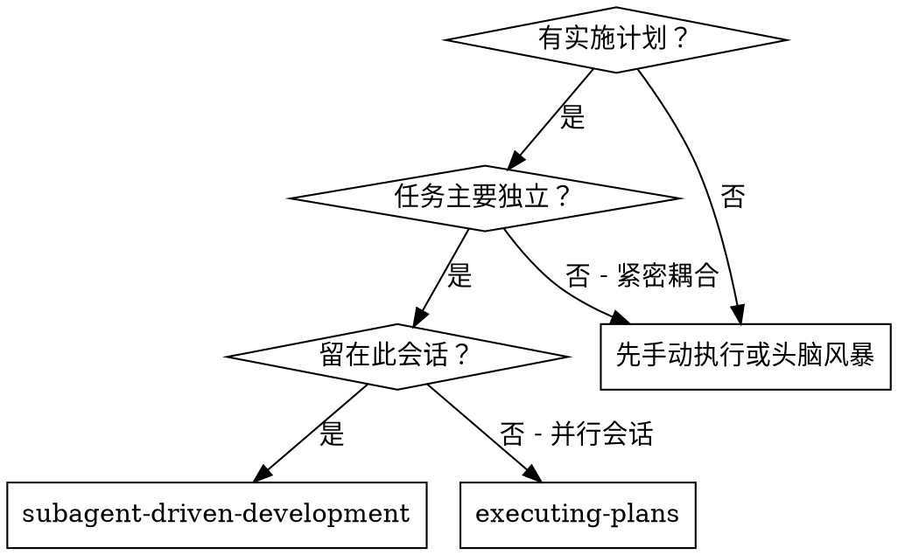
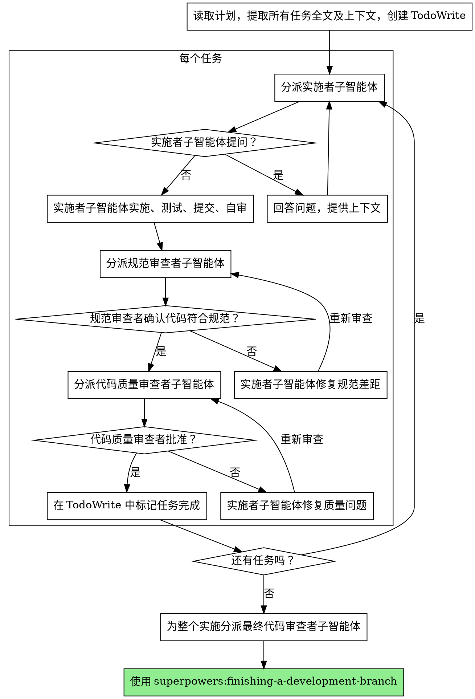

# 子智能体驱动开发 (Subagent-Driven Development)

通过为每个任务分派新的子智能体来执行计划，并在每个任务后进行两阶段审查：首先是规范合规性审查，然后是代码质量审查。

**核心原则：** 每个任务新的子智能体 + 两阶段审查（先规范后质量） = 高质量、快速迭代

## 何时使用



**对比 执行计划 (executing-plans) (并行会话):**
- 同一会话（无上下文切换）
- 每个任务新的子智能体（无上下文污染）
- 每个任务后的两阶段审查：先规范合规性，后代码质量
- 更快的迭代（任务之间无需人工介入）

## 流程



## 提示词模板 (Prompt Templates)

- `./implementer-prompt.md` - 分派实施者子智能体
- `./spec-reviewer-prompt.md` - 分派规范合规性审查者子智能体
- `./code-quality-reviewer-prompt.md` - 分派代码质量审查者子智能体

## 示例工作流

```
You: 我正在使用子智能体驱动开发来执行此计划。

[读取一次计划文件: docs/plans/feature-plan.md]
[提取所有 5 个任务的全文和上下文]
[用所有任务创建 TodoWrite]

Task 1: Hook installation script

[获取任务 1 文本和上下文 (已提取)]
[分派带有完整任务文本 + 上下文的实施子智能体]

Implementer: "在我开始之前 - 钩子应该安装在用户级别还是系统级别？"

You: "User level (~/.config/superpowers/hooks/)"

Implementer: "Got it. Implementing now..."
[Later] Implementer:
  - Implemented install-hook command
  - Added tests, 5/5 passing
  - Self-review: Found I missed --force flag, added it
  - Committed

[分派规范合规性审查者]
Spec reviewer: ✅ 符合规范 - 满足所有要求，没有多余内容

[获取 git SHAs, 分派代码质量审查者]
Code reviewer: 优势: 良好的测试覆盖率，整洁。问题: 无。批准。

[标记任务 1 完成]

Task 2: Recovery modes

[获取任务 2 文本和上下文 (已提取)]
[分派带有完整任务文本 + 上下文的实施子智能体]

Implementer: [No questions, proceeds]
Implementer:
  - Added verify/repair modes
  - 8/8 tests passing
  - Self-review: All good
  - Committed

[分派规范合规性审查者]
Spec reviewer: ❌ 问题:
  - 缺失: 进度报告 (规范说 "每 100 项报告一次")
  - 多余: 添加了 --json 标志 (未请求)

[实施者修复问题]
Implementer: Removed --json flag, added progress reporting

[规范审查者再次审查]
Spec reviewer: ✅ 现在符合规范

[分派代码质量审查者]
Code reviewer: 优势: 稳固。问题 (重要): 魔法数字 (100)

[实施者修复]
Implementer: Extracted PROGRESS_INTERVAL constant

[代码审查者再次审查]
Code reviewer: ✅ 批准

[标记任务 2 完成]

...

[所有任务之后]
[分派最终代码审查者]
Final reviewer: 满足所有要求，准备合并

Done!
```

## 优势

**对比 手动执行:**
- 子智能体自然遵循 TDD
- 每个任务新鲜的上下文（无混淆）
- 并行安全（子智能体互不干扰）
- 子智能体可以提问（工作前和工作中）

**对比 执行计划 (Executing Plans):**
- 同一会话（无移交）
- 持续进展（无等待）
- 审查检查点自动进行

**效率提升:**
- 无文件读取开销（控制器提供全文）
- 控制器准确筛选所需上下文
- 子智能体预先获得完整信息
- 问题在工作开始前浮现（而不是之后）

**质量门:**
- 自我审查在移交前捕捉问题
- 两阶段审查：先规范合规性，后代码质量
- 审查循环确保修复实际有效
- 规范合规性防止过度/不足构建
- 代码质量确保实施构建良好

**成本:**
- 更多子智能体调用（每任务实施者 + 2 个审查者）
- 控制器做更多准备工作（预先提取所有任务）
- 审查循环增加迭代
- 但早期捕捉问题（比后期调试便宜）

## 危险信号 (Red Flags)

**绝不:**
- 跳过审查（规范合规性 或 代码质量）
- 带着未修复的问题继续
- 并行分派多个实施子智能体（冲突）
- 让子智能体读取计划文件（改为提供全文）
- 跳过场景设置上下文（子智能体需要了解任务的定位）
- 忽略子智能体的问题（在让他们继续前回答）
- 在规范合规性上接受“差不多”（规范审查者发现问题 = 未完成）
- 跳过审查循环（审查者发现问题 = 实施者修复 = 再次审查）
- 让实施者自我审查代替实际审查（两者都需要）
- **在规范合规性通过前开始代码质量审查**（顺序错误）
- 在任一审查有未解决问题时移动到下一个任务

**如果子智能体提问:**
- 清晰且完整地回答
- 如果需要提供额外上下文
- 不要催促他们进入实施

**如果审查者发现问题:**
- 实施者（同一子智能体）修复它们
- 审查者再次审查
- 重复直到批准
- 不要跳过重新审查

**如果子智能体任务失败:**
- 分派修复子智能体并给出具体指令
- 不要尝试手动修复（上下文污染）

## 集成

**必需的工作流技能:**
- **superpowers:writing-plans** - 创建此技能执行的计划
- **superpowers:requesting-code-review** - 审查者子智能体的代码审查模板
- **superpowers:finishing-a-development-branch** - 所有任务后完成开发

**子智能体应使用:**
- **superpowers:test-driven-development** - 子智能体为每个任务遵循 TDD

**替代工作流:**
- **superpowers:executing-plans** - 用于并行会话而非同一会话执行