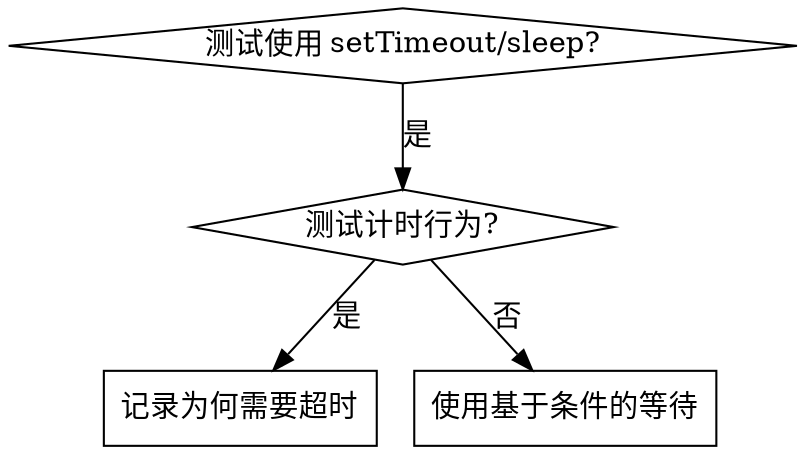

# 基于条件的等待 (Condition-Based Waiting)

## 概述

不稳定的测试经常使用任意延迟来猜测时间。这会产生竞争条件，使得测试在快速机器上通过，但在负载下或 CI 中失败。

**核心原则：** 等待你关心的实际条件，而不是猜测它需要多长时间。

## 何时使用



**在以下情况使用：**
- 测试有任意延迟 (`setTimeout`, `sleep`, `time.sleep()`)
- 测试不稳定（有时通过，负载下失败）
- 并行运行时测试超时
- 等待异步操作完成

**在以下情况不要使用：**
- 测试实际计时行为（防抖、节流间隔）
- 始终记录如果使用任意超时的原因

## 核心模式

```typescript
// ❌ 之前：猜测时间
await new Promise(r => setTimeout(r, 50));
const result = getResult();
expect(result).toBeDefined();

// ✅ 之后：等待条件
await waitFor(() => getResult() !== undefined);
const result = getResult();
expect(result).toBeDefined();
```

## 快速模式

| 场景 | 模式 |
|----------|---------|
| 等待事件 | `waitFor(() => events.find(e => e.type === 'DONE'))` |
| 等待状态 | `waitFor(() => machine.state === 'ready')` |
| 等待计数 | `waitFor(() => items.length >= 5)` |
| 等待文件 | `waitFor(() => fs.existsSync(path))` |
| 复杂条件 | `waitFor(() => obj.ready && obj.value > 10)` |

## 实施

通用轮询函数：
```typescript
async function waitFor<T>(
  condition: () => T | undefined | null | false,
  description: string,
  timeoutMs = 5000
): Promise<T> {
  const startTime = Date.now();

  while (true) {
    const result = condition();
    if (result) return result;

    if (Date.now() - startTime > timeoutMs) {
      throw new Error(`Timeout waiting for ${description} after ${timeoutMs}ms`);
    }

    await new Promise(r => setTimeout(r, 10)); // Poll every 10ms
  }
}
```

参见此目录中的 `condition-based-waiting-example.ts`，了解来自实际调试会话的特定领域辅助函数 (`waitForEvent`, `waitForEventCount`, `waitForEventMatch`) 的完整实施。

## 常见错误

**❌ 轮询太快：** `setTimeout(check, 1)` - 浪费 CPU
**✅ 修复：** 每 10ms 轮询一次

**❌ 无超时：** 如果条件从未满足则无限循环
**✅ 修复：** 始终包含带有清晰错误的超时

**❌ 陈旧数据：** 在循环前缓存状态
**✅ 修复：** 在循环内调用 getter 以获取新鲜数据

## 何时任意超时是正确的

```typescript
// Tool ticks every 100ms - need 2 ticks to verify partial output
await waitForEvent(manager, 'TOOL_STARTED'); // First: wait for condition
await new Promise(r => setTimeout(r, 200));   // Then: wait for timed behavior
// 200ms = 2 ticks at 100ms intervals - documented and justified
```

**要求：**
1. 首先等待触发条件
2. 基于已知时间（不猜测）
3. 解释**为什么**的注释

## 现实世界影响

来自调试会话 (2025-10-03)：
- 修复了 3 个文件中的 15 个不稳定测试
- 通过率：60% → 100%
- 执行时间：快 40%
- 不再有竞争条件