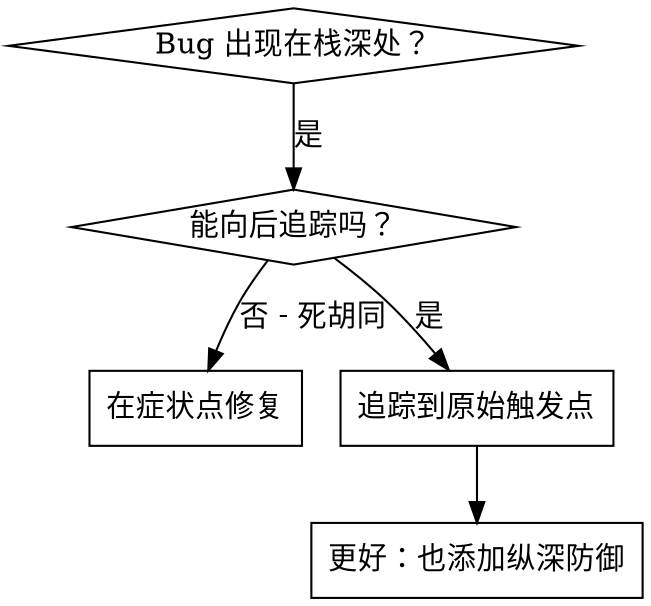
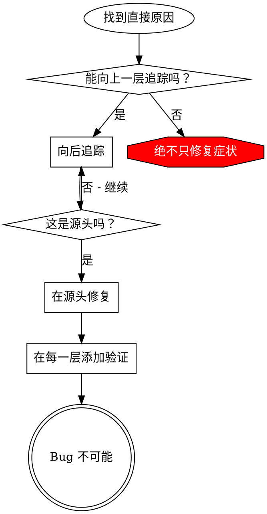

# 根本原因追踪 (Root Cause Tracing)

## 概述

Bug 经常出现在调用栈深处（在错误的目录 git init，文件创建在错误的位置，数据库用错误的路径打开）。你的本能是修复错误出现的地方，但这只是治疗症状。

**核心原则：** 通过调用链向后追踪，直到找到原始触发点，然后在源头修复。

## 何时使用



**在以下情况使用：**
- 错误发生在执行深处（不是在入口点）
- 堆栈跟踪显示长调用链
- 不清楚无效数据源自哪里
- 需要找到哪个测试/代码触发了问题

## 追踪流程

### 1. 观察症状
```
Error: git init failed in /Users/jesse/project/packages/core
```

### 2. 找到直接原因
**什么代码直接导致了这个？**
```typescript
await execFileAsync('git', ['init'], { cwd: projectDir });
```

### 3. 问：什么调用了这个？
```typescript
WorktreeManager.createSessionWorktree(projectDir, sessionId)
  → called by Session.initializeWorkspace()
  → called by Session.create()
  → called by test at Project.create()
```

### 4. 持续向上追踪
**传递了什么值？**
- `projectDir = ''` (空字符串!)
- 空字符串作为 `cwd` 解析为 `process.cwd()`
- 那是源代码目录！

### 5. 找到原始触发点
**空字符串来自哪里？**
```typescript
const context = setupCoreTest(); // Returns { tempDir: '' }
Project.create('name', context.tempDir); // Accessed before beforeEach!
```

## 添加堆栈跟踪

当你无法手动追踪时，添加仪表：

```typescript
// Before the problematic operation
async function gitInit(directory: string) {
  const stack = new Error().stack;
  console.error('DEBUG git init:', {
    directory,
    cwd: process.cwd(),
    nodeEnv: process.env.NODE_ENV,
    stack,
  });

  await execFileAsync('git', ['init'], { cwd: directory });
}
```

**关键：** 在测试中使用 `console.error()`（而不是 logger - 可能会被抑制）

**运行并捕获：**
```bash
npm test 2>&1 | grep 'DEBUG git init'
```

**分析堆栈跟踪：**
- 寻找测试文件名
- 找到触发调用的行号
- 识别模式（相同的测试？相同的参数？）

## 查找哪个测试导致污染

如果某事在测试期间出现但你不知道是哪个测试：

使用此目录中的二分查找脚本 `find-polluter.sh`：

```bash
./find-polluter.sh '.git' 'src/**/*.test.ts'
```

逐个运行测试，在第一个污染者处停止。查看脚本以了解用法。

## 真实示例：空 projectDir

**症状：** `.git` 创建在 `packages/core/` (源代码)

**追踪链：**
1. `git init` 运行在 `process.cwd()` ← 空 cwd 参数
2. WorktreeManager 被用空 projectDir 调用
3. Session.create() 传入空字符串
4. Test 在 beforeEach 之前访问 `context.tempDir`
5. setupCoreTest() 最初返回 `{ tempDir: '' }`

**根本原因：** 顶层变量初始化访问空值

**修复：** 使 tempDir 成为一个 getter，如果在 beforeEach 之前访问则抛出

**也添加了纵深防御：**
- 第 1 层: Project.create() 验证目录
- 第 2 层: WorkspaceManager 验证非空
- 第 3 层: NODE_ENV 卫士拒绝 tmpdir 之外的 git init
- 第 4 层: git init 前的堆栈跟踪日志

## 关键原则



**绝不只修复错误出现的地方。** 向后追踪以找到原始触发点。

## 堆栈跟踪技巧

**在测试中：** 使用 `console.error()` 而非 logger - logger 可能会被抑制
**操作前：** 在危险操作之前记录，而不是在失败之后
**包含上下文：** 目录，cwd，环境变量，时间戳
**捕获堆栈：** `new Error().stack` 显示完整调用链

## 现实世界影响

来自调试会话 (2025-10-03)：
- 通过 5 层追踪找到根本原因
- 在源头修复（getter 验证）
- 添加了 4 层防御
- 1847 个测试通过，零污染