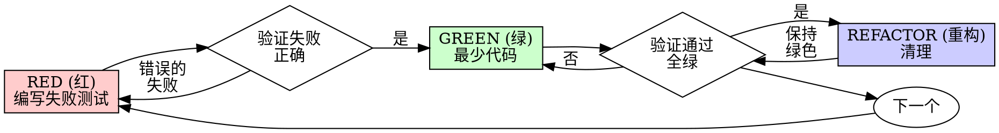

---
name: test-driven-development
description: 在编写实施代码之前，实施任何功能或错误修复时使用
---

# 测试驱动开发 (TDD)

## 概述

先写测试。看着它失败。编写最少的代码使其通过。

**核心原则：** 如果你没看着测试失败，你就不知道它是否测试了正确的东西。

**违反规则的字面意义就是违反规则的精神。**

## 何时使用

**始终:**
- 新功能
- Bug 修复
- 重构
- 行为变更

**例外 (询问你的人类伙伴):**
- 一次性原型
- 生成的代码
- 配置文件

想着“就这一次跳过 TDD”？停止。那是借口。

## 铁律

```
NO PRODUCTION CODE WITHOUT A FAILING TEST FIRST
(没有先行的失败测试，绝不写生产代码)
```

如果你在测试前写了代码？删除它。重新开始。

**在解释测试失败、重构原因、或向用户汇报 TDD 进展时，必须使用自然、专业的中文。**

## 红-绿-重构



### RED (红) - 编写失败测试

编写一个显示应该发生什么的最少测试。

<Good>
```typescript
test('retries failed operations 3 times', async () => {
  let attempts = 0;
  const operation = () => {
    attempts++;
    if (attempts < 3) throw new Error('fail');
    return 'success';
  };

  const result = await retryOperation(operation);

  expect(result).toBe('success');
  expect(attempts).toBe(3);
});
```
清晰的名称，测试真实行为，一件事
</Good>

<Bad>
```typescript
test('retry works', async () => {
  const mock = jest.fn()
    .mockRejectedValueOnce(new Error())
    .mockRejectedValueOnce(new Error())
    .mockResolvedValueOnce('success');
  await retryOperation(mock);
  expect(mock).toHaveBeenCalledTimes(3);
});
```
模糊的名称，测试模拟而非代码
</Bad>

**要求:**
- 一个行为
- 清晰的名称
- 真实代码（除非不可避免，否则不模拟）

### 验证 RED - 看着它失败

**强制性。绝不跳过。**

```bash
npm test path/to/test.test.ts
```

确认:
- 测试失败（而不是报错）
- 失败消息是预期的
- 失败是因为功能缺失（而不是拼写错误）

**测试通过？** 你在测试现有行为。修复测试。

**测试报错？** 修复错误，重新运行直到它正确失败。

### GREEN (绿) - 最少代码

编写最简单的代码使测试通过。

<Good>
```typescript
async function retryOperation<T>(fn: () => Promise<T>): Promise<T> {
  for (let i = 0; i < 3; i++) {
    try {
      return await fn();
    } catch (e) {
      if (i === 2) throw e;
    }
  }
  throw new Error('unreachable');
}
```
足以通过即可
</Good>

<Bad>
```typescript
async function retryOperation<T>(
  fn: () => Promise<T>,
  options?: {
    maxRetries?: number;
    backoff?: 'linear' | 'exponential';
    onRetry?: (attempt: number) => void;
  }
): Promise<T> {
  // YAGNI
}
```
过度工程化
</Bad>

不要添加功能、重构其他代码或在测试之外“改进”。

### 验证 GREEN - 看着它通过

**强制性。**

```bash
npm test path/to/test.test.ts
```

确认:
- 测试通过
- 其他测试仍然通过
- 输出干净（无错误、警告）

**测试失败？** 修复代码，而不是测试。

**其他测试失败？** 现在修复。

### REFACTOR (重构) - 清理

仅在绿色之后：
- 移除重复
- 改进命名
- 提取辅助函数

保持测试绿色。不要添加行为。

### 重复

下一个功能的下一个失败测试。

## 好的测试

| 质量 | 好 | 坏 |
|---------|------|-----|
| **最小化** | 一件事。名字里有 "and"？拆分它。 | `test('validates email and domain and whitespace')` |
| **清晰** | 名称描述行为 | `test('test1')` |
| **显示意图** | 演示期望的 API | 模糊代码应该做什么 |

## 为什么顺序很重要

**“我会在之后写测试来验证它有效”**

代码后写的测试立即通过。立即通过证明不了什么：
- 可能测错了东西
- 可能测试实施而非行为
- 可能错过你忘记的边缘情况
- 你从未见过它捕捉到 Bug

先测试强迫你看到测试失败，证明它实际上测试了某些东西。

**“我已经手动测试了所有边缘情况”**

手动测试是临时的。你认为你测试了一切，但是：
- 没有你测试内容的记录
- 代码变更时无法重新运行
- 压力下容易忘记情况
- “我试过时它是好的” ≠ 全面

自动化测试是系统的。它们每次都以相同方式运行。

**“删除 X 小时的工作是浪费”**

沉没成本谬误。时间已经过去了。你现在的选择：
- 删除并用 TDD 重写（多 X 小时，高信心）
- 保留并在之后添加测试（30 分钟，低信心，可能有 Bug）

“浪费”是保留你无法信任的代码。没有真实测试的有效代码是技术债务。

**“TDD 是教条主义，实用主义意味着适应”**

TDD **就是**实用主义：
- 在提交前发现 Bug（比之后调试更快）
- 防止回归（测试立即捕捉破坏）
- 记录行为（测试展示如何使用代码）
- 启用重构（自由更改，测试捕捉破坏）

“实用主义”捷径 = 在生产中调试 = 更慢。

**“后写测试达到同样的目标 - 是精神而不是仪式”**

不。后写测试回答“这做了什么？”先写测试回答“这应该做什么？”

后写测试受你的实施偏见影响。你测试你构建的东西，而不是被要求的东西。你验证记住的边缘情况，而不是发现的。

先写测试强迫在实施前发现边缘情况。后写测试验证你记住了所有东西（你没有）。

30 分钟的后写测试 ≠ TDD。你获得了覆盖率，失去了测试工作的证明。

## 常见合理化

| 借口 | 现实 |
|--------|---------|
| “太简单无需测试” | 简单代码会坏。测试只需 30 秒。 |
| “我会之后测试” | 立即通过的测试证明不了什么。 |
| “后写测试达到同样目标” | 后写测试 = “这做了什么？” 先写测试 = “这应该做什么？” |
| “已经手动测试了” | 临时 ≠ 系统。无记录，无法重新运行。 |
| “删除 X 小时是浪费” | 沉没成本谬误。保留未验证的代码是技术债务。 |
| “保留作为参考，先写测试” | 你会调整它。那是后写测试。删除意味着删除。 |
| “需要先探索” | 好的。扔掉探索，用 TDD 开始。 |
| “测试难 = 设计不清楚” | 听从测试。难测试 = 难使用。 |
| “TDD 会拖慢我” | TDD 比调试快。实用主义 = 先测试。 |
| “手动测试更快” | 手动证明不了边缘情况。你会每次变更都重新测试。 |
| “现有代码没测试” | 你在改进它。为现有代码添加测试。 |

## 危险信号 - 停止并重新开始

- 测试前的代码
- 实施后的测试
- 测试立即通过
- 无法解释测试为何失败
- 测试“稍后”添加
- 合理化“就这一次”
- “我已经手动测试过了”
- “后写测试达到同样目的”
- “这是关于精神而非仪式”
- “保留作为参考”或“调整现有代码”
- “已经花了 X 小时，删除是浪费”
- “TDD 是教条主义，我是实用主义者”
- “这次不同，因为...”

**所有这些意味着：删除代码。用 TDD 重新开始。**

## 示例：Bug 修复

**Bug:** 接受空邮件

**RED (红)**
```typescript
test('rejects empty email', async () => {
  const result = await submitForm({ email: '' });
  expect(result.error).toBe('Email required');
});
```

**验证 RED**
```bash
$ npm test
FAIL: expected 'Email required', got undefined
```

**GREEN (绿)**
```typescript
function submitForm(data: FormData) {
  if (!data.email?.trim()) {
    return { error: 'Email required' };
  }
  // ...
}
```

**验证 GREEN**
```bash
$ npm test
PASS
```

**REFACTOR (重构)**
如果需要，提取多字段验证。

## 验证清单

在标记工作完成之前：

- [ ] 每个新函数/方法都有测试
- [ ] 在实施前看着每个测试失败
- [ ] 每个测试因预期原因失败（功能缺失，非拼写错误）
- [ ] 编写最少代码通过每个测试
- [ ] 所有测试通过
- [ ] 输出干净（无错误、警告）
- [ ] 测试使用真实代码（除非不可避免，否则仅模拟）
- [ ] 边缘情况和错误已覆盖

无法勾选所有框？你跳过了 TDD。重新开始。

## 卡住时

| 问题 | 解决方案 |
|---------|----------|
| 不知道如何测试 | 写出期望的 API。先写断言。问你的人类伙伴。 |
| 测试太复杂 | 设计太复杂。简化接口。 |
| 必须模拟一切 | 代码太耦合。使用依赖注入。 |
| 测试设置巨大 | 提取辅助函数。仍然复杂？简化设计。 |

## 调试集成

发现 Bug？编写复现它的失败测试。遵循 TDD 循环。测试证明修复并防止回归。

绝不在没有测试的情况下修复 Bug。

## 测试反模式

当添加模拟或测试工具时，阅读 @testing-anti-patterns.md 以避免常见陷阱：
- 测试模拟行为而非真实行为
- 向生产类添加仅用于测试的方法
- 在不理解依赖关系的情况下模拟

## 最终规则

```
生产代码 → 测试存在且先失败
否则 → 不是 TDD
```

未经你的人类伙伴许可，无例外。
