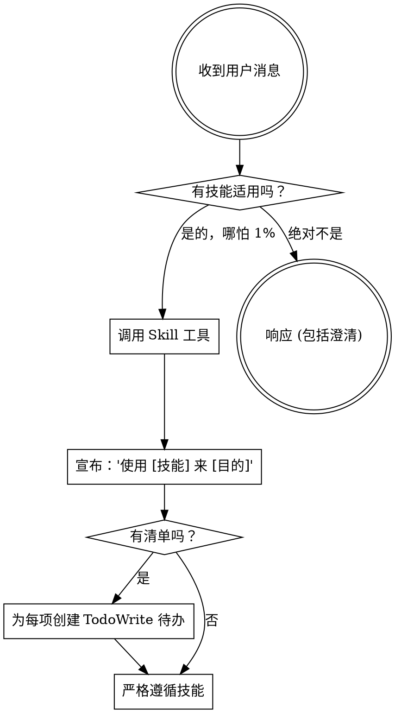

<EXTREMELY-IMPORTANT>
如果你认为即使有 1% 的机会某个技能可能适用于你正在做的事情，你也**绝对必须**调用该技能。

如果一项技能适用于你的任务，你没有选择。你必须使用它。

这是不可协商的。这不是可选的。你不能通过合理化来逃避这一点。
</EXTREMELY-IMPORTANT>

## 如何访问技能

**在 Claude Code 中：** 使用 `Skill` 工具。当你调用一个技能时，它的内容会被加载并展示给你——直接遵循它。永远不要对技能文件使用 Read 工具。

**在其他环境中：** 查看你的平台文档以了解如何加载技能。

# 使用技能

## 规则

**在任何响应或行动之前调用相关或请求的技能。** 即使只有 1% 的机会技能可能适用，也意味着你应该调用该技能进行检查。如果调用的技能结果不适合当前情况，你不需要使用它。

**在引导用户使用其他技能或进行状态确认时，必须使用自然、专业的中文。**

## 危险信号

这些想法意味着**停止**——你在进行合理化（找借口）：

| 想法 | 现实 |
|---------|---------|
| "这只是一个简单的问题" | 问题就是任务。检查技能。 |
| "我先需要更多上下文" | 技能检查在澄清问题**之前**。 |
| "让我先探索一下代码库" | 技能会告诉你**如何**探索。先检查。 |
| "我可以快速检查 git/文件" | 文件缺乏对话上下文。检查技能。 |
| "让我先收集信息" | 技能会告诉你**如何**收集信息。 |
| "这不需要正式的技能" | 如果有技能存在，使用它。 |
| "我记得这个技能" | 技能在进化。阅读当前版本。 |
| "这不算是一个任务" | 行动 = 任务。检查技能。 |
| "这技能有点大材小用" | 简单的事情会变复杂。使用它。 |
| "我先做这一件事" | 在做任何事**之前**先检查。 |
| "这感觉很有效率" | 无纪律的行动是浪费时间。技能防止这种情况。 |
| "我知道那是什么意思" | 知道概念 ≠ 使用技能。调用它。 |

## 编码安全 (Encoding Safety)

在 Windows 环境下，**必须**遵循 `superpowers-zh:utf8-safe-file-handling` 技能。

- 优先使用内置工具 (`read_file`, `write_file`, `replace`) 处理文本。
- 严禁通过 Shell 重定向 (`>`) 写入包含中文的文件。
- 确保所有生成或修改的文件均采用 **UTF-8 无 BOM** 编码。

## 技能优先级

当多个技能可能适用时，使用此顺序：

1. **流程技能优先** (brainstorming, debugging) - 这些决定了**如何**处理任务
2. **实施技能次之** (frontend-design, mcp-builder) - 这些指导执行

"让我们构建 X" → 先 `brainstorming`，然后是实施技能。
"修复这个 Bug" → 先 `debugging`，然后是特定领域的技能。

## 技能类型

**刚性 (Rigid)** (TDD, debugging): 严格遵循。不要因适应而放弃纪律。

**灵活 (Flexible)** (patterns): 将原则适应于上下文。

技能本身会告诉你属于哪一种。

## 用户指令

指令说的是**做什么 (WHAT)**，而不是**怎么做 (HOW)**。“添加 X”或“修复 Y”并不意味着跳过工作流。
