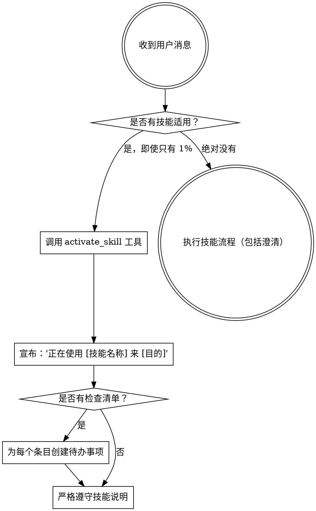

<EXTREMELY-IMPORTANT>
如果你认为即使有 1% 的可能性某个技能适用于你正在执行的任务，你都**必须**激活该技能。

如果某个技能适用于你的任务，你没有选择余地。你**必须**使用它。

这不是可协商的。这不是可选的。你不能找借口规避这一点。
</EXTREMELY-IMPORTANT>

# 使用超能力 (Using Superpowers)

## 概述

此技能是 Gemini CLI 的元技能（Meta-Skill），负责强制执行技能优先的工作流。它建立了“技能是行动的唯一合法依据”的绝对规则。

**核心原则：**
1.  **技能优先 (Skill First)**：任何行动前，必须先激活对应技能。
2.  **强制激活 (Mandatory Activation)**：即使你觉得自己记得内容，也必须调用 `activate_skill`。
3.  **流程就是法律 (Process is Law)**：一旦技能激活，其内部流程必须被严格执行，不得跳过。

## 何时使用

- **每一次**对话开始时。
- **每一次**收到用户新指令时。
- **每一次**你准备执行某项任务（写代码、修 Bug、做设计）时。
- **每一次**上下文重置或觉得“丢失了方向”时。

## 核心法则

### 1. 必须进行技能检查

在做出任何实质性响应或调用工具之前，**必须**执行以下逻辑检查：
1.  分析用户意图（如“修复 Bug”）。
2.  扫描可用技能列表（如 `systematic-debugging`）。
3.  **激活**最相关的技能。

### 2. 严禁凭记忆行事

- **严禁**因为“我记得这个技能怎么说”而不去激活它。
- 技能文件可能会更新。**必须**始终加载最新版本。
- 激活不仅仅是为了读取内容，更是为了向用户宣告你的操作模式。

### 3. 必须遵循流程图

### 4. 优先级仲裁

当多个技能适用时，**必须**按此顺序激活：
1.  **流程类技能** (如 `brainstorming`, `systematic-debugging`) - **必须**先确定“怎么做”。
2.  **实施类技能** (如 `writing-plans`, `test-driven-development`) - 指导具体的执行。

### 5. 会话持久化 (Session Persistence)

- 技能激活不是一次性的。在长对话中，**必须**定期（每 5-10 轮）自我反省：“我是否仍在其轨道上？”
- 如果发现偏离，**必须**重新声明：“我正在继续使用 [技能名]...”。

## 借口粉碎机 (Excuse Smasher)

| 借口 | 事实反击 |
|------|----------|
| “这只是个简单的问题，不用激活技能” | 简单的问题最容易因为轻视而出错。技能是防止自大的安全带。 |
| “我需要先了解更多背景信息” | 技能检查必须在提出澄清问题之前进行。技能会告诉你该问什么。 |
| “我可以快速检查一下 git/文件” | 文件缺乏对话背景。技能会指导你如何正确地探索。 |
| “这不需要正式的技能” | 如果存在相关技能，就必须使用它。这是纪律问题。 |
| “这样做感觉很有成效” | 无纪律的行动是低效的忙碌。技能将行动转化为结果。 |

## 危险信号 (Red Flags)

如果出现以下情况，**立即停止**并自我纠正：

- 你直接回答了用户的问题，而没有先调用 `activate_skill`。
- 你在回复中说“根据我的知识库...”，而不是“根据已激活的 [技能名]...”。
- 用户问“怎么修这个 Bug”，你直接给出了代码，而不是激活 `systematic-debugging`。
- 你在长对话的中途不再提及任何技能名称，变成了“闲聊模式”。
- 你认为“这次例外”。 -> **永远没有例外。**
