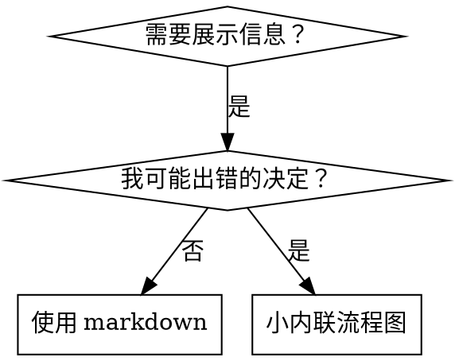

# 编写技能 (Writing Skills)

## 概述

**编写技能就是应用于流程文档的测试驱动开发。**

**个人技能位于特定于智能体的目录中 (`~/.claude/skills` for Claude Code, `~/.codex/skills` for Codex)**

你编写测试用例（带有子智能体的压力场景），看着它们失败（基线行为），编写技能（文档），看着测试通过（智能体合规），并重构（堵住漏洞）。

**核心原则：** 如果你没有看着一个没有技能的智能体失败，你就不知道这个技能是否教导了正确的东西。

**必需背景：** 在使用此技能之前，你**必须**了解 superpowers:test-driven-development。该技能定义了基本的 RED-GREEN-REFACTOR 循环。此技能将 TDD 调整为文档。

**官方指南：** 有关 Anthropic 的官方技能编写最佳实践，请参阅 anthropic-best-practices.md。本文档提供了补充此技能中专注于 TDD 方法的额外模式和指南。

## 什么是技能？

**技能**是经过验证的技术、模式或工具的参考指南。技能帮助未来的 Claude 实例找到并应用有效的方法。

**技能是：** 可重用的技术、模式、工具、参考指南

**技能不是：** 关于你曾如何解决问题的叙述

## 技能的 TDD 映射

| TDD 概念 | 技能创建 |
|-------------|----------------|
| **Test case** | 带有子智能体的压力场景 |
| **Production code** | 技能文档 (SKILL.md) |
| **Test fails (RED)** | 智能体在没有技能时违反规则（基线） |
| **Test passes (GREEN)** | 智能体在有技能时合规 |
| **Refactor** | 在保持合规的同时堵住漏洞 |
| **Write test first** | 在编写技能之前运行基线场景 |
| **Watch it fail** | 记录智能体使用的确切合理化 |
| **Minimal code** | 编写解决这些特定违规的技能 |
| **Watch it pass** | 验证智能体现在合规 |
| **Refactor cycle** | 发现新的合理化 → 堵住 → 重新验证 |

整个技能创建过程遵循 RED-GREEN-REFACTOR。

## 何时创建技能

**在以下情况创建：**
- 技术对你来说并不直观
- 你会在跨项目中再次引用它
- 模式广泛适用（非特定于项目）
- 其他人会受益

**不要为以下情况创建：**
- 一次性解决方案
- 其他地方已有良好文档的标准实践
- 特定于项目的惯例（放入 CLAUDE.md）
- 机械约束（如果可以用正则/验证强制执行，自动化它——将文档留给判断调用）

## 技能类型

### 技术 (Technique)
具有要遵循步骤的具体方法 (condition-based-waiting, root-cause-tracing)

### 模式 (Pattern)
思考问题的方式 (flatten-with-flags, test-invariants)

### 参考 (Reference)
API 文档、语法指南、工具文档 (office docs)

## 目录结构

```
skills/
  skill-name/
    SKILL.md              # 主要参考 (必需)
    supporting-file.*     # 仅在需要时
```

**扁平命名空间** - 所有技能在一个可搜索的命名空间中

**单独的文件用于：**
1. **重型参考** (100+ 行) - API 文档，综合语法
2. **可重用工具** - 脚本，实用程序，模板

**保持内联：**
- 原则和概念
- 代码模式 (< 50 行)
- 其他所有内容

## SKILL.md 结构

**Frontmatter (YAML):**
- 仅支持两个字段：`name` 和 `description`
- 总共最多 1024 个字符
- `name`: 仅使用字母、数字和连字符（无括号、特殊字符）
- `description`: 第三人称，仅描述**何时**使用（不是它做什么）
  - 以 "Use when..." 开头以关注触发条件
  - 包含具体的症状、情况和上下文
  - **绝不总结技能的流程或工作流**（参见 CSO 部分的原因）
  - 如果可能，保持在 500 个字符以内

```markdown
---
name: Skill-Name-With-Hyphens
description: Use when [specific triggering conditions and symptoms]
---

# Skill Name

## Overview
What is this? Core principle in 1-2 sentences.

## When to Use
[Small inline flowchart IF decision non-obvious]

Bullet list with SYMPTOMS and use cases
When NOT to use

## Core Pattern (for techniques/patterns)
Before/after code comparison

## Quick Reference
Table or bullets for scanning common operations

## Implementation
Inline code for simple patterns
Link to file for heavy reference or reusable tools

## Common Mistakes
What goes wrong + fixes

## Real-World Impact (optional)
Concrete results
```

## Claude 搜索优化 (CSO)

**对发现至关重要：** 未来的 Claude 需要找到你的技能

### 1. 丰富的描述字段

**目的：** Claude 阅读描述以决定为给定任务加载哪些技能。让它回答：“我现在应该阅读此技能吗？”

**格式：** 以 "Use when..." 开头以关注触发条件

**关键：描述 = 何时使用，而非技能做什么**

描述应仅描述触发条件。不要在描述中总结技能的流程或工作流。

**为什么这很重要：** 测试表明，当描述总结技能的工作流时，Claude 可能会遵循描述而不是阅读完整的技能内容。描述说“任务之间的代码审查”导致 Claude 做**一次**审查，即使技能的流程图清楚地显示了**两次**审查（规范合规性然后代码质量）。

当描述更改为仅“Use when executing implementation plans with independent tasks” (无工作流摘要) 时，Claude 正确阅读了流程图并遵循了两阶段审查流程。

**陷阱：** 总结工作流的描述创建了 Claude 会采取的捷径。技能正文变成 Claude 跳过的文档。

```yaml
# ❌ BAD: Summarizes workflow - Claude may follow this instead of reading skill
description: Use when executing plans - dispatches subagent per task with code review between tasks

# ❌ BAD: Too much process detail
description: Use for TDD - write test first, watch it fail, write minimal code, refactor

# ✅ GOOD: Just triggering conditions, no workflow summary
description: Use when executing implementation plans with independent tasks in the current session

# ✅ GOOD: Triggering conditions only
description: Use when implementing any feature or bugfix, before writing implementation code
```

**内容：**
- 使用具体的触发器、症状和情况来表明此技能适用
- 描述*问题* (竞争条件, 不一致的行为) 而不是*特定语言的症状* (setTimeout, sleep)
- 保持触发器与技术无关，除非技能本身特定于技术
- 如果技能特定于技术，要在触发器中明确
- 用第三人称写（注入到系统提示词中）
- **绝不总结技能的流程或工作流**

```yaml
# ❌ BAD: Too abstract, vague, doesn't include when to use
description: For async testing

# ❌ BAD: First person
description: I can help you with async tests when they're flaky

# ❌ BAD: Mentions technology but skill isn't specific to it
description: Use when tests use setTimeout/sleep and are flaky

# ✅ GOOD: Starts with "Use when", describes problem, no workflow
description: Use when tests have race conditions, timing dependencies, or pass/fail inconsistently

# ✅ GOOD: Technology-specific skill with explicit trigger
description: Use when using React Router and handling authentication redirects
```

### 2. 关键词覆盖

使用 Claude 会搜索的词：
- 错误消息: "Hook timed out", "ENOTEMPTY", "race condition"
- 症状: "flaky", "hanging", "zombie", "pollution"
- 同义词: "timeout/hang/freeze", "cleanup/teardown/afterEach"
- 工具: 实际命令，库名称，文件类型

### 3. 描述性命名

**使用主动语态，动词优先：**
- ✅ `creating-skills` not `skill-creation`
- ✅ `condition-based-waiting` not `async-test-helpers`

### 4. Token 效率 (关键)

**问题：** getting-started 和频繁引用的技能会加载到每个会话中。每个 Token 都很重要。

**目标字数：**
- getting-started 工作流: 每个 <150 字
- 频繁加载的技能: 总共 <200 字
- 其他技能: <500 字 (仍需简洁)

**技术：**

**将细节移至工具帮助：**
```bash
# ❌ BAD: Document all flags in SKILL.md
search-conversations supports --text, --both, --after DATE, --before DATE, --limit N

# ✅ GOOD: Reference --help
search-conversations supports multiple modes and filters. Run --help for details.
```

**使用交叉引用：**
```markdown
# ❌ BAD: Repeat workflow details
When searching, dispatch subagent with template...
[20 lines of repeated instructions]

# ✅ GOOD: Reference other skill
Always use subagents (50-100x context savings). REQUIRED: Use [other-skill-name] for workflow.
```

**压缩示例：**
```markdown
# ❌ BAD: Verbose example (42 words)
your human partner: "How did we handle authentication errors in React Router before?"
You: I'll search past conversations for React Router authentication patterns.
[Dispatch subagent with search query: "React Router authentication error handling 401"]

# ✅ GOOD: Minimal example (20 words)
Partner: "How did we handle auth errors in React Router?"
You: Searching...
[Dispatch subagent → synthesis]
```

**消除冗余：**
- 不要重复交叉引用技能中的内容
- 不要解释从命令中显而易见的内容
- 不要包含同一模式的多个示例

**验证：**
```bash
wc -w skills/path/SKILL.md
# getting-started workflows: aim for <150 each
# Other frequently-loaded: aim for <200 total
```

**按你要做什么或核心见解命名：**
- ✅ `condition-based-waiting` > `async-test-helpers`
- ✅ `using-skills` not `skill-usage`
- ✅ `flatten-with-flags` > `data-structure-refactoring`
- ✅ `root-cause-tracing` > `debugging-techniques`

**动名词 (-ing) 适合流程：**
- `creating-skills`, `testing-skills`, `debugging-with-logs`
- 主动，描述你正在采取的行动

### 4. 交叉引用其他技能

**当编写引用其他技能的文档时：**

仅使用技能名称，带有明确的需求标记：
- ✅ Good: `**REQUIRED SUB-SKILL:** Use superpowers:test-driven-development`
- ✅ Good: `**REQUIRED BACKGROUND:** You MUST understand superpowers:systematic-debugging`
- ❌ Bad: `See skills/testing/test-driven-development` (不清楚是否必需)
- ❌ Bad: `@skills/testing/test-driven-development/SKILL.md` (强制加载，消耗上下文)

**为什么不用 @ 链接：** `@` 语法立即强制加载文件，在你需要它们之前消耗 200k+ 上下文。

## 流程图使用



**仅在以下情况使用流程图：**
- 非显而易见的决策点
- 你可能过早停止的流程循环
- "何时使用 A vs B" 的决策

**绝不在以下情况使用流程图：**
- 参考材料 → 表格，列表
- 代码示例 → Markdown 块
- 线性指令 → 编号列表
- 无语义含义的标签 (step1, helper2)

参见 @graphviz-conventions.dot 了解 graphviz 风格规则。

**为你的人类伙伴可视化：** 使用此目录中的 `render-graphs.js` 将技能的流程图渲染为 SVG：
```bash
./render-graphs.js ../some-skill           # Each diagram separately
./render-graphs.js ../some-skill --combine # All diagrams in one SVG
```

## 代码示例

**一个优秀的示例胜过许多平庸的示例**

选择最相关的语言：
- 测试技术 → TypeScript/JavaScript
- 系统调试 → Shell/Python
- 数据处理 → Python

**好的示例：**
- 完整且可运行
- 注释良好，解释**为什么**
- 来自真实场景
- 清晰展示模式
- 准备好适配（而非通用模板）

**不要：**
- 用 5+ 种语言实施
- 创建填空模板
- 编写做作的示例

你擅长移植——一个很好的例子就足够了。

## 文件组织

### 自包含技能
```
defense-in-depth/
  SKILL.md    # 一切内联
```
何时：所有内容都适合，不需要重型参考

### 带有可重用工具的技能
```
condition-based-waiting/
  SKILL.md    # 概述 + 模式
  example.ts  # 可适配的工作辅助函数
```
何时：工具是可重用的代码，不仅仅是叙述

### 带有重型参考的技能
```
pptx/
  SKILL.md       # 概述 + 工作流
  pptxgenjs.md   # 600 行 API 参考
  ooxml.md       # 500 行 XML 结构
  scripts/       # 可执行工具
```
何时：参考材料太大不适合内联

## 铁律 (同 TDD)

```
NO SKILL WITHOUT A FAILING TEST FIRST
(没有先行的失败测试，绝不写技能)
```

这适用于**新**技能**和**对现有技能的**编辑**。

在测试前写技能？删除它。重新开始。
未测试就编辑技能？同样的违规。

**无例外:**
- 不是为了“简单的添加”
- 不是为了“只是添加一个部分”
- 不是为了“文档更新”
- 不要保留未经测试的更改作为“参考”
- 不要在运行测试时“调整”
- 删除意味着删除

**必需背景：** superpowers:test-driven-development 技能解释了为什么这很重要。同样的原则适用于文档。

## 测试所有技能类型

不同的技能类型需要不同的测试方法：

### 纪律执行技能 (规则/要求)

**示例:** TDD, verification-before-completion, designing-before-coding

**测试用：**
- 学术问题：他们理解规则吗？
- 压力场景：他们在压力下遵守吗？
- 多重压力结合：时间 + 沉没成本 + 疲劳
- 识别合理化并添加明确反击

**成功标准：** 智能体在最大压力下遵循规则

### 技术技能 (操作指南)

**示例:** condition-based-waiting, root-cause-tracing, defensive-programming

**测试用：**
- 应用场景：他们能正确应用技术吗？
- 变体场景：他们处理边缘情况吗？
- 缺失信息测试：指令有缺口吗？

**成功标准：** 智能体成功将技术应用于新场景

### 模式技能 (心智模型)

**示例:** reducing-complexity, information-hiding concepts

**测试用：**
- 识别场景：他们识别何时应用模式吗？
- 应用场景：他们能使用心智模型吗？
- 反例：他们知道何时**不**应用吗？

**成功标准：** 智能体正确识别何时/如何应用模式

### 参考技能 (文档/APIs)

**示例:** API 文档, 命令参考, 库指南

**测试用：**
- 检索场景：他们能找到正确信息吗？
- 应用场景：他们能正确使用找到的信息吗？
- 缺口测试：涵盖常见用例吗？

**成功标准：** 智能体找到并正确应用参考信息

## 跳过测试的常见合理化

| 借口 | 现实 |
|--------|---------|
| “技能显然很清楚” | 对你清楚 ≠ 对其他智能体清楚。测试它。 |
| “这只是参考” | 参考可能有缺口，不清楚的部分。测试检索。 |
| “测试是大材小用” | 未经测试的技能有问题。总是。15 分钟测试节省数小时。 |
| “如果有问题我会测试” | 问题 = 智能体无法使用技能。在部署**之前**测试。 |
| “测试太乏味” | 测试比在生产中调试糟糕的技能不那么乏味。 |
| “我有信心它是好的” | 过度自信保证有问题。无论如何都要测试。 |
| “学术审查足够了” | 阅读 ≠ 使用。测试应用场景。 |
| “没时间测试” | 部署未经测试的技能以后会浪费更多时间修复它。 |

**所有这些意味着：部署前测试。无例外。**

## 防止技能被合理化

执行纪律的技能（如 TDD）需要抵制合理化。智能体很聪明，在压力下会找到漏洞。

**心理学注：** 理解说服技术**为何**有效有助于你系统地应用它们。参见 persuasion-principles.md 了解关于权威、承诺、稀缺、社会证明和统一原则的研究基础 (Cialdini, 2021; Meincke et al., 2025)。

### 明确堵住每个漏洞

不要只陈述规则 - 禁止具体的变通方法：

<Bad>
```markdown
Write code before test? Delete it.
```
</Bad>

<Good>
```markdown
Write code before test? Delete it. Start over.

**No exceptions:**
- Don't keep it as "reference"
- Don't "adapt" it while writing tests
- Don't look at it
- Delete means delete
```
</Good>

### 解决“精神 vs 字面”争论

及早添加基本原则：

```markdown
**违反规则的字面意义就是违反规则的精神。**
```

这切断了整个“我遵循精神”的合理化类别。

### 建立合理化表

从基线测试中捕捉合理化（见下面的测试部分）。智能体做的每个借口都放入表中：

```markdown
| Excuse | Reality |
|--------|---------|
| "Too simple to test" | Simple code breaks. Test takes 30 seconds. |
| "I'll test after" | Tests passing immediately prove nothing. |
| "Tests after achieve same goals" | Tests-after = "what does this do?" Tests-first = "what should this do?" |
```

### 创建危险信号列表

让智能体在合理化时容易自查：

```markdown
## Red Flags - STOP and Start Over

- Code before test
- "I already manually tested it"
- "Tests after achieve the same purpose"
- "It's about spirit not ritual"
- "This is different because..."

**All of these mean: Delete code. Start over with TDD.**
```

### 为违规症状更新 CSO

添加到描述：当你**即将**违反规则时的症状：

```yaml
description: use when implementing any feature or bugfix, before writing implementation code
```

## 技能的 RED-GREEN-REFACTOR

遵循 TDD 循环：

### RED (红): 编写失败测试 (基线)

在**没有**技能的情况下运行子智能体的压力场景。记录确切行为：
- 他们做了什么选择？
- 他们使用了什么合理化（逐字）？
- 哪些压力触发了违规？

这就是“看着测试失败”——你必须在编写技能之前看到智能体自然会做什么。

### GREEN (绿): 编写最少技能

编写解决那些特定合理化的技能。不要为假设情况添加额外内容。

**有**技能的情况下运行相同场景。智能体现在应该合规。

### REFACTOR (重构): 堵住漏洞

智能体发现了新的合理化？添加明确反击。重新测试直到防弹。

**测试方法论：** 参见 @testing-skills-with-subagents.md 了解完整的测试方法论：
- 如何编写压力场景
- 压力类型（时间、沉没成本、权威、疲劳）
- 系统地堵住漏洞
- 元测试技术

## 反模式

### ❌ 叙述性示例
"In session 2025-10-03, we found empty projectDir caused..."
**为什么坏：** 太具体，不可重用

### ❌ 多语言稀释
example-js.js, example-py.py, example-go.go
**为什么坏：** 平庸的质量，维护负担

### ❌ 流程图中的代码
```dot
step1 [label="import fs"];
step2 [label="read file"];
```
**为什么坏：** 无法复制粘贴，难以阅读

### ❌ 通用标签
helper1, helper2, step3, pattern4
**为什么坏：** 标签应具有语义含义

## STOP: 在移动到下一个技能之前

**在编写任何技能之后，你必须停止并完成部署过程。**

**不要：**
- 批量创建多个技能而不测试每个
- 在当前技能验证之前移动到下一个
- 因为“批处理更有效率”而跳过测试

**下面的部署清单对于每个技能都是强制性的。**

部署未经测试的技能 = 部署未经测试的代码。这是对质量标准的违反。

## 技能创建清单 (TDD 适配)

**重要：使用 TodoWrite 为下面的每个清单项目创建待办事项。**

**RED Phase - Write Failing Test:**
- [ ] 创建压力场景（纪律技能 3+ 组合压力）
- [ ] 在没有技能的情况下运行场景 - 逐字记录基线行为
- [ ] 识别合理化/失败中的模式

**GREEN Phase - Write Minimal Skill:**
- [ ] 名称仅使用字母、数字、连字符（无括号/特殊字符）
- [ ] YAML frontmatter 仅包含名称和描述（最多 1024 字符）
- [ ] 描述以 "Use when..." 开头并包含具体触发器/症状
- [ ] 描述用第三人称编写
- [ ] 全文包含用于搜索的关键词（错误、症状、工具）
- [ ] 清晰的概述和核心原则
- [ ] 解决 RED 阶段识别的具体基线失败
- [ ] 代码内联或链接到单独文件
- [ ] 一个优秀的示例（非多语言）
- [ ] 在有技能的情况下运行场景 - 验证智能体现在合规

**REFACTOR Phase - Close Loopholes:**
- [ ] 识别测试中的新合理化
- [ ] 添加明确反击（如果是纪律技能）
- [ ] 从所有测试迭代中构建合理化表
- [ ] 创建危险信号列表
- [ ] 重新测试直到防弹

**Quality Checks:**
- [ ] 仅在决策非显而易见时使用小流程图
- [ ] 快速参考表
- [ ] 常见错误部分
- [ ] 无叙述性讲故事
- [ ] 仅用于工具或重型参考的支持文件

**Deployment:**
- [ ] 将技能提交到 git 并推送到你的分叉（如果配置了）
- [ ] 考虑通过 PR 贡献回去（如果广泛有用）

## 发现工作流

未来的 Claude 如何找到你的技能：

1. **遇到问题** ("tests are flaky")
3. **找到 SKILL** (描述匹配)
4. **扫描概述** (这相关吗？)
5. **阅读模式** (快速参考表)
6. **加载示例** (仅在实施时)

**为此流程优化** - 将可搜索术语尽早并经常放置。

## 结论

**创建技能就是流程文档的 TDD。**

同样的铁律：没有先行的失败测试就没有技能。
同样的循环：RED (基线) → GREEN (编写技能) → REFACTOR (堵住漏洞)。
同样的好处：更好的质量，更少的意外，防弹的结果。

如果你对代码遵循 TDD，对技能也要遵循。这是同样的纪律应用于文档。